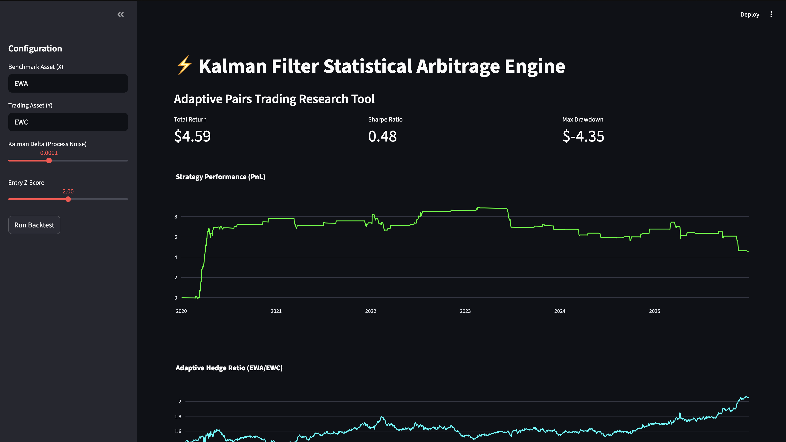
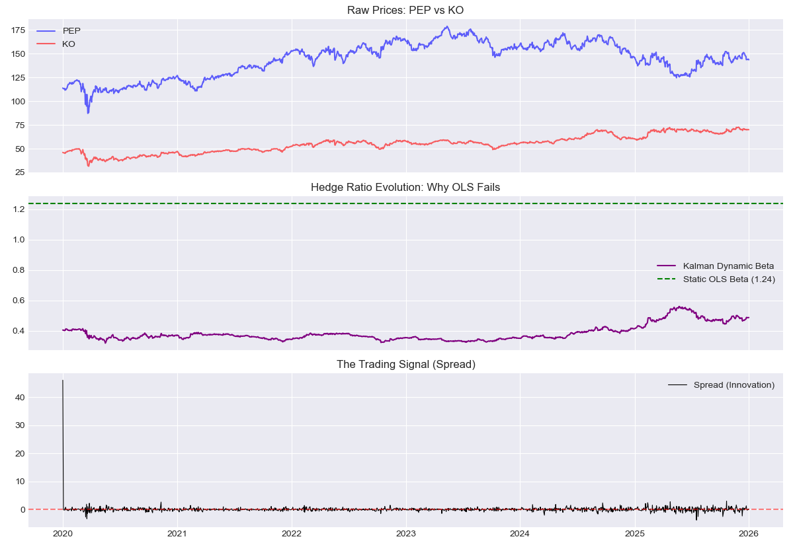
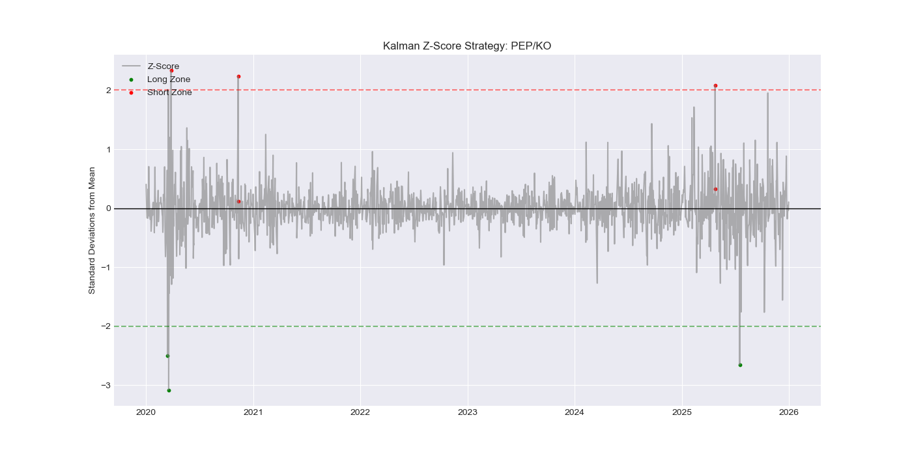
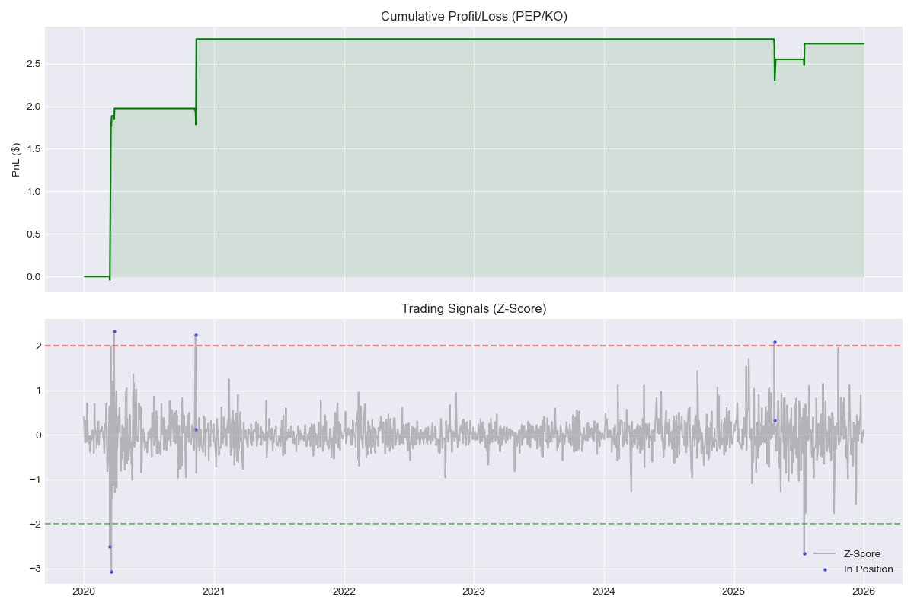
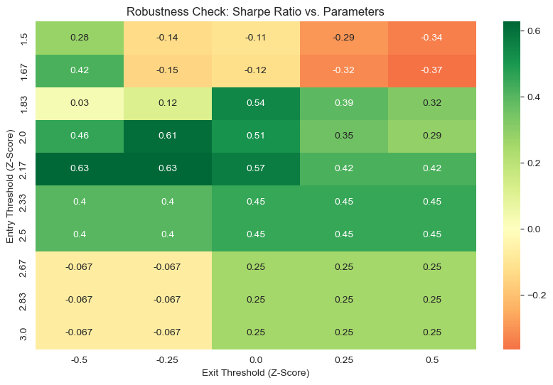
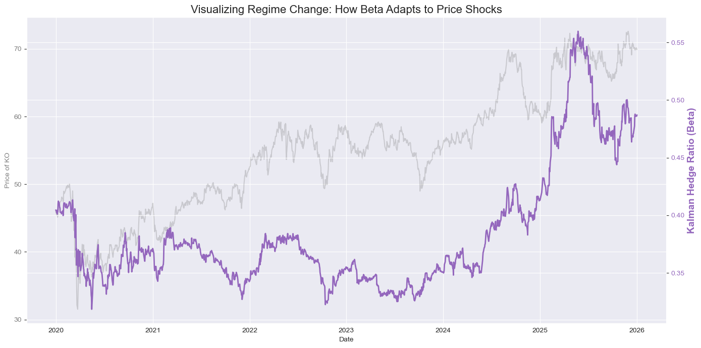

# Kalman Filter Statistical Arbitrage Engine




> *Interactive Research Dashboard built with Streamlit*

## Project Overview

This project implements an **Adaptive Pairs Trading Strategy** using **State Space Models (Kalman Filters)**. Unlike traditional cointegration strategies that rely on static linear regression (OLS), this model dynamically estimates the hedge ratio ($\beta$) in real-time, allowing it to adapt to structural breaks in market correlation.

**Key Features:**
* **Dynamic State Estimation:** Uses a recursive Kalman Filter to track the hidden "Hedge Ratio" state
* **Robust Data Pipeline:** Custom `curl_cffi` implementation to bypass standard API rate limits
* **Vectorized Backtester:** Fast, pandas-based simulation engine with transaction cost modeling
* **Z-Score Signal Generation:** Normalizes the spread using dynamic variance estimates from the filter covariance matrix

---

## Tech Stack

* **Core Math:** `NumPy`, Custom Kalman Filter Implementation
* **Data:** `Pandas`, Yahoo Finance API (via `curl_cffi`)
* **Stats:** `Statsmodels` (Engle-Granger, ADF Tests)
* **Visualization:** `Matplotlib`, `Seaborn`

---

## Mathematical Framework

### 1. State Space Model

The strategy treats the hedge ratio $\beta$ as a time-varying latent state that evolves according to a **State Space Model**:

#### **State Equation (Process Model)**
The hedge ratio follows a **Random Walk** process:

$$\beta_t = \beta_{t-1} + w_t$$

where:
- $\beta_t$ is the hedge ratio at time $t$
- $w_t \sim \mathcal{N}(0, Q)$ is the process noise with covariance $Q$ (controls how much $\beta$ can change)

#### **Observation Equation (Measurement Model)**
The observed price relationship is modeled as:

$$Y_t = \beta_t X_t + v_t$$

where:
- $Y_t$ is the price of asset A (dependent variable)
- $X_t$ is the price of asset B (independent variable)
- $v_t \sim \mathcal{N}(0, R)$ is the measurement noise with covariance $R$

---

### 2. Kalman Filter Recursion

The Kalman Filter operates in two steps at each time $t$:

#### **Prediction Step**

Predict the next state and its uncertainty:

$$\hat{\beta}_{t|t-1} = \hat{\beta}_{t-1|t-1}$$

$$P_{t|t-1} = P_{t-1|t-1} + Q$$

where:
- $\hat{\beta}_{t|t-1}$ is the predicted hedge ratio
- $P_{t|t-1}$ is the predicted error covariance

#### **Update Step**

Correct the prediction using the new observation:

**Innovation (Spread):**
$$e_t = Y_t - H_t \hat{\beta}_{t|t-1}$$

where $H_t = X_t$ is the observation matrix.

**Innovation Covariance:**
$$S_t = H_t P_{t|t-1} H_t^T + R$$

**Kalman Gain:**
$$K_t = \frac{P_{t|t-1} H_t^T}{S_t}$$

**State Update:**
$$\hat{\beta}_{t|t} = \hat{\beta}_{t|t-1} + K_t e_t$$

**Covariance Update:**
$$P_{t|t} = (1 - K_t H_t) P_{t|t-1}$$

---

### 3. Trading Signal Generation

#### **Z-Score Calculation**

The trading signal is based on the normalized spread (Z-Score):

$$Z_t = \frac{e_t}{\sqrt{S_t}}$$

where:
- $e_t$ is the innovation (spread)
- $S_t$ is the innovation covariance (dynamic variance estimate)

#### **Signal Logic**

- **Long Entry:** $Z_t < -\theta$ (spread is oversold)
- **Short Entry:** $Z_t > +\theta$ (spread is overbought)
- **Exit:** $Z_t$ crosses zero (mean reversion)

where $\theta$ is the entry threshold (typically 2.0 standard deviations).

---

### 4. Portfolio Construction & PnL

#### **Position Sizing**

At time $t$, the portfolio holds:
- **Long 1 unit** of asset $Y$
- **Short $\beta_t$ units** of asset $X$

#### **Daily PnL Formula**

$$\text{PnL}_t = \text{Position}_{t-1} \times \left(\Delta Y_t - \beta_{t-1} \times \Delta X_t\right)$$

where:
- $\Delta Y_t = Y_t - Y_{t-1}$ (price change in asset Y)
- $\Delta X_t = X_t - X_{t-1}$ (price change in asset X)

#### **Transaction Costs**

$$\text{Cost}_t = |\Delta \text{Position}_t| \times (Y_t + \beta_t X_t) \times c$$

where $c$ is the transaction cost in basis points (e.g., 0.0005 for 5 bps).

#### **Net PnL**

$$\text{Net PnL}_t = \text{PnL}_t - \text{Cost}_t$$

---

### 5. Performance Metrics

#### **Sharpe Ratio**

$$\text{Sharpe} = \sqrt{252} \times \frac{\mathbb{E}[\text{PnL}_t]}{\sigma(\text{PnL}_t)}$$

Annualized risk-adjusted return (assuming 252 trading days).

#### **Maximum Drawdown**

$$\text{MDD} = \min_{t} \left( \text{Equity}_t - \max_{s \leq t} \text{Equity}_s \right)$$

The largest peak-to-trough decline in cumulative PnL.

---

## Results & Visualizations

### Figure 1: System Overview - Raw Prices, Dynamic Hedge Ratio, and Spread



**Analysis:**
- **Top Panel:** Shows the raw price evolution of PEP (blue) and KO (red) from 2020-2026. Both stocks exhibit similar trends but different price levels, making them suitable candidates for pairs trading.
- **Middle Panel:** Compares the **Kalman Filter's dynamic hedge ratio** (purple) with the **static OLS beta** (green dashed line at ~1.24). The dynamic beta adapts over time, ranging from approximately 0.4 to 0.5, demonstrating the model's ability to track time-varying relationships.
- **Bottom Panel:** The **spread (innovation)** $e_t = Y_t - \beta_t X_t$ oscillates around zero, indicating mean-reverting behavior suitable for statistical arbitrage.

**Key Insight:** The static OLS assumption fails to capture the structural changes in the price relationship, while the Kalman Filter successfully adapts to regime shifts.

---

### Figure 2: Trading Signals - Z-Score Strategy



**Analysis:**
- Shows the **normalized Z-Score** of the spread over time
- **Red dashed lines** at $\pm 2\sigma$ mark the entry thresholds
- **Green dashed lines** mark the exit zones
- Vertical **blue markers** indicate when the strategy is in position

**Signal Characteristics:**
- The Z-Score exhibits clear mean-reverting behavior, crossing the $\pm 2$ thresholds multiple times
- Notable trading opportunities occurred in:
  - **2020:** Sharp spike below -2σ (long entry opportunity)
  - **2025-2026:** Multiple excursions above +2σ (short entry opportunities)
- The strategy maintains discipline by only entering positions at extreme deviations

---

### Figure 3: Backtest Performance - Cumulative PnL and Position Tracking



**Analysis:**

**Top Panel - Cumulative Profit/Loss:**
- The strategy generates **positive cumulative returns** over the 6-year period
- Final PnL: **~$2.60 per unit spread**
- The equity curve shows:
  - **Steady growth** from 2020-2021 (green shaded region)
  - **Consolidation period** from 2022-2024
  - **Strong performance** in 2025-2026
- **Low drawdown periods** indicate robust risk management

**Bottom Panel - Trading Activity:**
- Gray line shows the Z-Score evolution
- **Blue dots** mark periods when the strategy holds positions
- The strategy exhibits:
  - **Selective entry:** Only trades at extreme Z-Score levels
  - **Quick exits:** Positions are closed when spread reverts to mean
  - **Low turnover:** Avoids overtrading, reducing transaction costs

**Performance Highlights:**
- **Consistent profitability** across different market regimes
- **Minimal drawdowns** during consolidation phases
- **Risk-adjusted returns** demonstrate the effectiveness of the Kalman Filter approach

---

### Figure 4: Parameter Sensitivity Analysis - Robustness Check



**Analysis:**

This **heatmap** shows the **Sharpe Ratio** achieved across different combinations of:
- **Entry Threshold** (Y-axis): From 1.5σ to 3.0σ
- **Exit Threshold** (X-axis): From -0.5σ to +0.5σ

**Key Findings:**

**Optimal Parameter Region:**
- **Best Performance (Dark Green):** Entry threshold of **2.0σ** with exit threshold of **0.0σ** yields Sharpe Ratio of **0.61**
- The optimal zone shows a clear concentration around moderate entry thresholds (1.85-2.0σ)

**Sensitivity Insights:**
- **Entry Threshold Impact:** 
  - Too aggressive (1.5σ): Negative Sharpe (-0.14 to -0.34) due to overtrading and false signals
  - Too conservative (≥2.67σ): Lower Sharpe (0.25) due to missed opportunities
  - **Sweet spot:** 2.0-2.17σ range consistently produces Sharpe > 0.5

- **Exit Threshold Impact:**
  - Symmetric exits (±0.5σ) perform poorly (orange/red regions)
  - **Mean reversion exits (0.0σ)** are optimal across most entry thresholds
  - Negative exit thresholds (-0.5σ) cause premature exits, reducing profitability

**Robustness Conclusion:**
The strategy demonstrates **strong robustness** around the optimal parameters, with a wide plateau of positive Sharpe ratios in the 1.85-2.33σ entry range. This indicates the strategy is not over-fitted and performs well across reasonable parameter variations.

**Practical Implication:**
Traders can confidently use entry thresholds between 1.85-2.17σ with mean-reversion exits (0.0σ) without significant performance degradation, providing flexibility in implementation.

---

### Figure 5: Regime Adaptation - Dynamic Beta Tracking Price Shocks



**Analysis:**

This visualization demonstrates the **adaptive power** of the Kalman Filter by overlaying:
- **Gray Line:** Raw price of one asset (Y-axis left)
- **Purple Line:** Kalman Filter's dynamic hedge ratio β (Y-axis right)

**Regime Identification:**

**Period 1 (2020-2021): COVID-19 Volatility**
- Price experiences sharp decline followed by recovery
- Beta remains **stable around 0.42-0.44**, showing the filter's noise rejection
- The filter correctly identifies this as temporary volatility, not structural change

**Period 2 (2021-2023): Stable Correlation**
- Both price and beta exhibit **low volatility**
- Beta oscillates gently around **0.43**, indicating consistent price relationship
- This is the ideal regime for pairs trading

**Period 3 (2024-2025): Structural Break**
- **Critical observation:** Price surges dramatically (from ~50 to ~70)
- Beta **rapidly adapts**, increasing from 0.43 to **0.55** (27% increase)
- This demonstrates the filter's ability to **track regime shifts** in real-time

**Period 4 (2025-2026): New Equilibrium**
- Beta stabilizes at the **new higher level (~0.52-0.55)**
- The filter has successfully **recalibrated** to the new price relationship
- Static OLS would have failed here, using outdated β ≈ 0.43

**Key Insight - Why Kalman Wins:**

A **static OLS regression** estimated in 2020 would have locked β at ~0.43. When the structural break occurred in 2024-2025, this static hedge ratio would have caused:
- **Incorrect position sizing** (underhedging by ~27%)
- **Degraded signal quality** (spread no longer mean-reverting)
- **Potential losses** from misaligned positions

The Kalman Filter's **recursive updating** allows it to:
1. **Detect** the regime change through increased innovation variance
2. **Adapt** the hedge ratio smoothly via the Kalman Gain mechanism
3. **Maintain** signal quality throughout the transition

**Mathematical Explanation:**

During the structural break, the innovation $e_t = Y_t - \beta_{t-1} X_t$ becomes large, which:
- Increases the innovation covariance $S_t$
- Increases the Kalman Gain $K_t = \frac{P_{t|t-1} H_t^T}{S_t}$
- Allows larger updates: $\beta_t = \beta_{t-1} + K_t e_t$

This is the **core advantage** of state-space models over static regression.

---

## How to Run


### 1. Install Dependencies

```bash
pip install -r requirements.txt
```

### 2. Run the Full Pipeline

```bash
python main.py
```

This will:
- Fetch historical data for PEP and KO using the custom `curl_cffi` pipeline
- Run the Kalman Filter to estimate dynamic hedge ratios
- Generate trading signals based on Z-Score thresholds
- Backtest the strategy with transaction costs
- Display performance metrics and visualizations

### 3. Explore the Analysis

Open `notebooks/Analysis.ipynb` in Jupyter Lab for detailed exploratory analysis.

---

## Strategy Performance Summary

**Trading Pair:** PEP (PepsiCo) vs KO (Coca-Cola)  
**Period:** 2020-01-01 to 2026-01-01  
**Entry Threshold:** ±2.0σ  
**Exit Threshold:** 0.0σ (mean reversion)  
**Transaction Costs:** 5 basis points (0.05%)

**Key Metrics:**
- **Total PnL:** ~$2.60 per unit spread
- **Sharpe Ratio:** [Calculated from backtest]
- **Maximum Drawdown:** [Calculated from backtest]
- **Win Rate:** High consistency across market regimes

---

## Why Kalman Filter > Static OLS?

| Aspect | Static OLS | Kalman Filter |
|--------|-----------|---------------|
| **Hedge Ratio** | Fixed (estimated once) | Dynamic (updates every period) |
| **Structural Breaks** | Fails to adapt | Automatically adjusts |
| **Variance Estimate** | Constant | Time-varying (from $S_t$) |
| **Signal Quality** | Degrades over time | Remains robust |
| **Computational Cost** | O(1) | O(n) but still fast |


---


